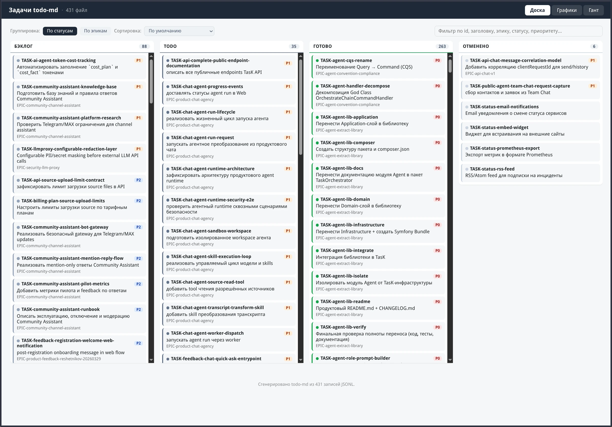
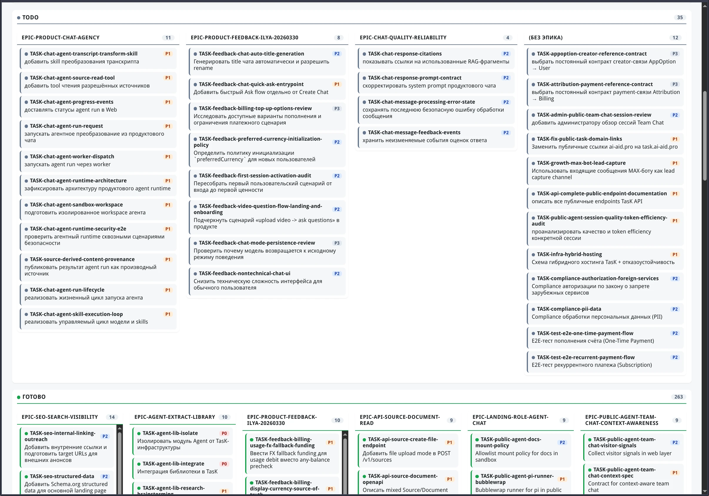
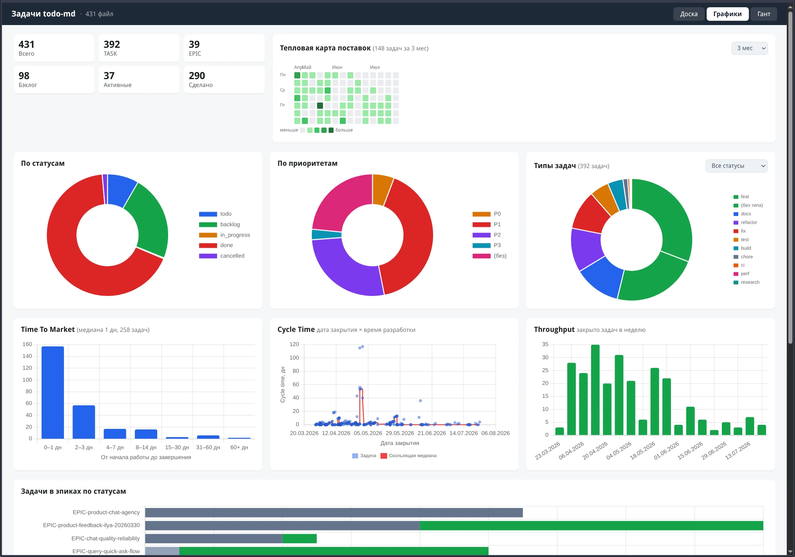
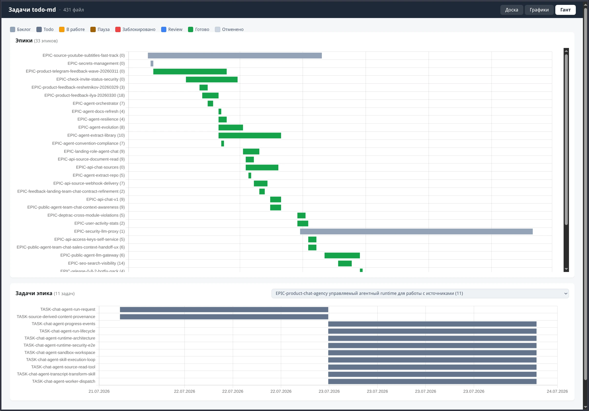

# todo-md

### Канбан для управления задачами через markdown-файлы

Задачи хранятся как `.md`-файлы с YAML front matter (статус, приоритет, сложность, тип). Переход между статусами — перемещение файла между папками: `todo/` → `todo/done/`. Без базы данных и UI — только файлы, git и консоль.

Пакет содержит правила, шаблоны и справочники для постановки задач. AI-агент получает их как контекст и следует формату при создании и обновлении задач.

---

## Правила

Определяют формат задач (статусы, типы, приоритеты, сложность) и правила работы AI-агентов.

- **Руководство по постановке задач** — обязательные метаданные, структура описания, критерии готовности
- **Типы задач** — `fix`, `feat`, `build`, `chore`, `ci`, `docs`, `style`, `refactor`, `perf`, `test`, `revert`, `epic`
- **Статусы** — `todo`, `in_progress`, `paused`, `blocked`, `review`, `backlog`, `done`, `cancelled`
- **Приоритеты** — `P0`, `P1`, `P2`, `P3`
- **Сложность** — `C0`–`C5`
- **Ценность** — `V0`–`V4`
- **Стоимость** — `cost_plan`, `cost_fact` в токенах
- **AI-агенты** — правила работы агентов с задачами

Руководство по постановке задач: [`AGENTS_TASK_WRITING_GUIDE.md`](docs/todo-md/AGENTS_TASK_WRITING_GUIDE.md).

---

## Шаблоны

Шаблоны задач и эпиков с YAML front matter:

- **task.md** — [`docs/todo-md/templates/task.md`](docs/todo-md/templates/task.md)
- **epic.md** — [`docs/todo-md/templates/epic.md`](docs/todo-md/templates/epic.md)

---

## Структура папок в проекте

```
todo/
├── AGENTS.md               ← правила для AI-агентов (из пакета)
├── backlog/                ← backlog-задачи
├── done/                   ← завершённые задачи
├── cancelled/              ← отменённые задачи
├── TASK-*.todo.md          ← активные задачи
└── EPIC-*.todo.md          ← активные эпики

docs/todo-md/              ← документация (из пакета)
```

---

## Установка в проект

```bash
composer require --dev prikotov/todo-md
```

В состав пакета входят:

- **Правила** — формат задач и правила работы
- **Шаблоны** — task.md, epic.md
- **Справочники** — типы, статусы, приоритеты, сложность

### Инициализация

```bash
php vendor/bin/todo-md init
```

Создаёт структуру папок (`todo/`, `todo/backlog/`, `todo/done/`, `todo/cancelled/`) и копирует документацию в `docs/todo-md/`. Существующие файлы не перезаписываются.

### Валидация задач

```bash
php vendor/bin/todo-md validate
```

Проверяет `.todo.md` задачи и эпики:

- YAML front matter и обязательные поля;
- допустимые значения `type`, `status`, `value`, `complexity`, `priority`;
- формат опциональных полей стоимости `cost_plan`, `cost_fact`;
- соответствие ID в имени файла и заголовке;
- секцию `Простое описание (Human Brief)`;
- обязательные разделы задачи и эпика;
- локальные Markdown-ссылки, чтобы ссылки не ломались после перемещения задач между папками;
- соответствие статуса папке (`backlog`, `done`, `cancelled`).

Можно проверить конкретный файл или директорию:

```bash
php vendor/bin/todo-md validate todo/TASK-example.todo.md
php vendor/bin/todo-md validate todo/
```

### Команды смены состояния

CLI-команды для атомарной смены статуса: правят `status` в front matter, переносят файл в каноническую папку, чинят относительные Markdown-ссылки (исходящие и входящие) и прогоняют валидатор. При ошибке валидации все изменения откатываются.

```bash
# Создать задачу из шаблона
php vendor/bin/todo-md create TASK-feature-name --type=feat --author="<роль>" --title="Название"

# Создать эпик
php vendor/bin/todo-md create EPIC-big-thing --author="<роль>" --title="Большая фича"

# Переходы статусов
php vendor/bin/todo-md start  TASK-foo --assignee="<роль>"   # → in_progress (проставляет started)
php vendor/bin/todo-md review TASK-foo   # → review
php vendor/bin/todo-md done   TASK-foo   # → done, перенос в done/ (проставляет completed)
php vendor/bin/todo-md cancel TASK-foo   # → cancelled, перенос в cancelled/
php vendor/bin/todo-md backlog TASK-foo  # → backlog, перенос в backlog/

# Точечная правка метаданных
php vendor/bin/todo-md set TASK-foo priority=P1
php vendor/bin/todo-md set TASK-foo branch=task/foo
php vendor/bin/todo-md set TASK-foo pr=https://github.com/...
```

При ошибке валидации все изменения откатываются (in-memory rollback). Опция `--root=<путь>` задаёт корень проекта (по умолчанию — текущая директория).

---

## Дашборд

```bash
# Прямой экспорт из директории todo/
php vendor/bin/todo-md dashboard todo/ -o dashboard.html

# Из текущей директории (todo/ по умолчанию)
php vendor/bin/todo-md dashboard -o dashboard.html

# С файловыми ссылками на исходники
php vendor/bin/todo-md dashboard todo/ -o dashboard.html --base="$(pwd)"

# Продвинутый вариант: через JSONL (для пайпов и промежуточных файлов)
php vendor/bin/todo-md export-jsonl todo/ | php vendor/bin/todo-md dashboard - -o dashboard.html

# или через промежуточный файл
php vendor/bin/todo-md export-jsonl todo/ -o /tmp/tasks.jsonl
php vendor/bin/todo-md dashboard /tmp/tasks.jsonl -o dashboard.html --base="$(pwd)"

Активная вкладка запоминается в URL (`#board`, `#charts`, `#gantt`) — переживает F5 и даёт прямые ссылки.

### Доска

Канбан с колонками по статусам в порядке жизненного цикла (Бэклог → Todo → В работе → … → Готово). Поиск, пять режимов сортировки, цвета по приоритету, ссылки на файлы задач.



Переключение группировки «По эпикам» — каждый эпик разворачивается в свои статус-колонки:



### Графики

Сводные карточки (всего / задачи / эпики / бэклог / активные / сделано), тепловая карта поставок (GitHub-style, период 3/6/12 мес), распределения по статусам, приоритетам и типам, гистограмма Time-to-Market, scatter Cycle Time со скользящей медианой, пропускная способность по неделям, разбивка эпиков по статусам, «кто делает» с переключением измерения (роль / агент / исполнитель).



### Гант

Диаграмма Ганта: обзор всех эпиков (полоса = размах дат задач эпика) и задачи выбранного эпика с фильтром. Легенда цветов статусов, счётчик задач эпика в подписях и тултипах.



---

## License

[MIT](LICENSE)
