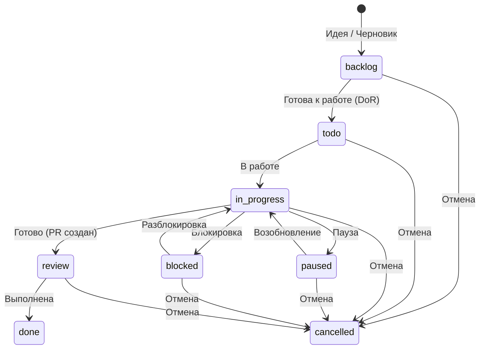

# Статусы задач и эпиков

Список допустимых статусов для использования в поле `Статус`.

## Активные задачи (папка `todo/`)
Задачи, которые находятся в активной работе или готовы к ней.

- **todo**: Задача запланирована и готова к выполнению.
- **in_progress**: Активная работа над задачей.
- **paused**: Работа приостановлена (смена приоритетов, не блокировка).
- **blocked**: Работа остановлена из-за внешних факторов/зависимостей.
- **review**: Результат на проверке (Code Review).

## Бэклог (папка `todo/backlog/`)
Задачи, отложенные на будущее или требующие уточнения.

- **backlog**: Задача в бэклоге.

## Завершенные (папка `todo/done/`)
Задачи, работа над которыми завершена.

- **done**: Работа завершена исполнителем и представлена к приёмке (acceptance).

## Отмененные (папка `todo/cancelled/`)
Задачи, работа над которыми отменена.

- **cancelled**: Задача отменена.

## Workflow движения задач


Диаграмма отражает порядок статусов, а не момент перехода.

### Основные переходы
1.  **Создание:** Задача создается в `todo/backlog/` (статус `backlog`) или сразу в `todo/` (статус `todo`), если готова к работе.
2.  **В работу:** Из `backlog` перемещается в `todo/` и меняет статус на `todo`.
3.  **Выполнение:** При начале работы статус меняется на `in_progress`.
4.  **Приостановка/Блокировка:** При возникновении проблем статус меняется на `paused` или `blocked`. Файл остается в `todo/`.
5.  **Завершение:** Статус меняется на `done`, файл перемещается в `todo/done/`. Момент перевода определяет процесс проекта. Возврат из `done` допустим (например, в `review` при замечаниях ревью) — CLI его не запрещает.
6.  **Отмена:** Если задача неактуальна, статус меняется на `cancelled`, файл перемещается в `todo/cancelled/`.

### Назначение исполнителя

- Поле `assignee` присутствует во всех задачах и эпиках.
- Пустое значение допустимо для `backlog`, `todo` и `cancelled`.
- Исполнитель обязателен для `in_progress`, `paused`, `blocked`, `review` и `done`.
- Отмена не очищает назначенного исполнителя, но задача может быть отменена до назначения.
- Любое заполненное значение проверяется по формату `<роль> (<агент>)`.

### CLI-команды для переходов

Смена статуса одной командой — атомарно правит `status`, переносит файл, чинит ссылки и валидирует:

```bash
# Создание
php vendor/bin/todo-md create  TASK-feature-name --type=feat --title="..."   # задача
php vendor/bin/todo-md create  EPIC-big-thing --title="Большая фича"         # эпик (без --type)

# Переходы — одинаково для задач и эпиков
php vendor/bin/todo-md start   TASK-name   # → in_progress
php vendor/bin/todo-md review  TASK-name   # → review
php vendor/bin/todo-md done    TASK-name   # → done (перенос в done/)
php vendor/bin/todo-md cancel  TASK-name   # → cancelled (перенос в cancelled/)
php vendor/bin/todo-md backlog TASK-name   # → backlog (перенос в backlog/)
```

Команды `start`, `done`, `cancel` автоматически проставляют lifecycle-даты (`started`, `completed`, `cancelled`).
